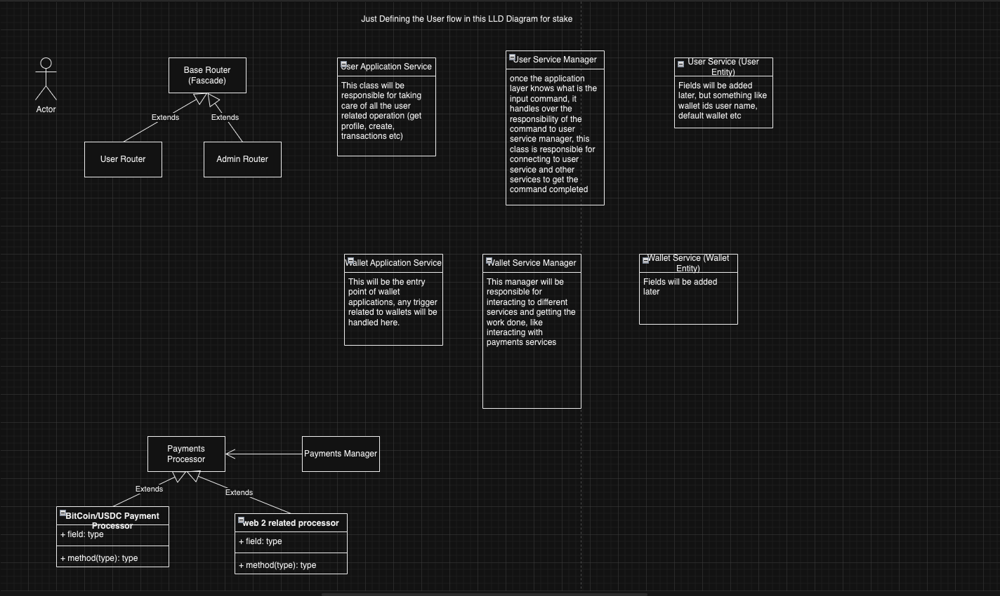

# Stake Platform

## Introduction

Stake Platform is an innovative betting platform designed to provide users with the ultimate gaming and betting experience using cryptocurrency. Users can explore and participate in a diverse range of games, placing bets seamlessly within the platform. This application will connect multiple games, enabling a large user base to conduct transactions directly in cryptocurrency, ensuring fast, secure, and transparent betting activities. The platform aims to offer an experience similar to Dream11, leveraging the advantages of cryptocurrency to enhance user convenience and engagement.

## Current Setup

In our low-level diagram, we are following a domain-driven design approach. This allows us to separate our components into multiple services easily when required. Each domain will have its own separate components, and there will be an integration component for everything. You can refer to the low-level diagram to understand the design implementation.

**Note**: The current design is just a standard template and may change based on future use cases. I believe it's a good starting point for the project.

Additionally, a high-level design (HLD) diagram is attached to the README. This diagram will guide us in using Docker containers to separate each service into individual containers. We will implement this change once the monorepo is ready.

## TODOs

Here is a basic TODO list to guide our initial implementation:

- **User Entity and Database**
  - Start with implementing the user entity and database.
  - Implement get, create, and update profile functionalities for the user entity.
- **Wallet Entity**
  - Implement the wallet entity.
  - Implement transactions for the wallet entity.
  - Leave the implementation of transactions for Harkirat (as discussed in the class).
- **Transactions and Balance Updates**
  - Have a black-box implementation for transactions and balance updates.
  - Start implementing integrations with games.
- **Frontend Development**
  - Start implementing the frontend for the user page and game plugin.

## Stake Proposed HLD - 

## Stake Proposed LLD - 
